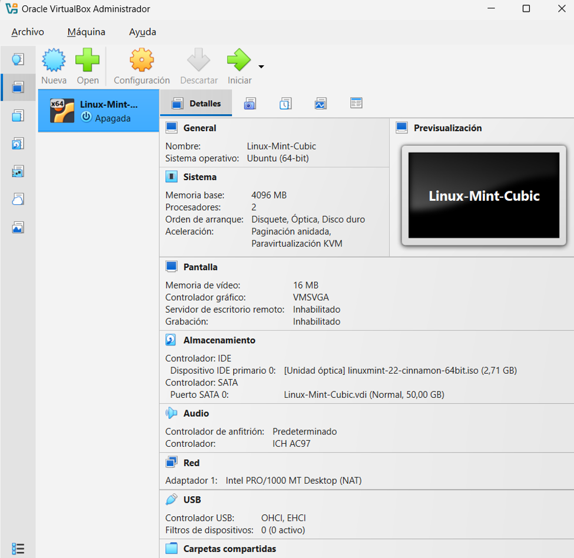
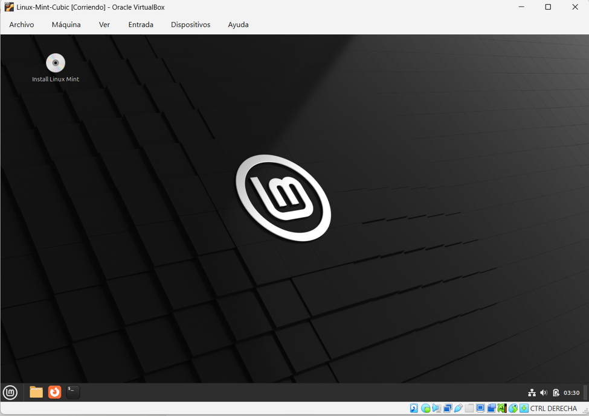
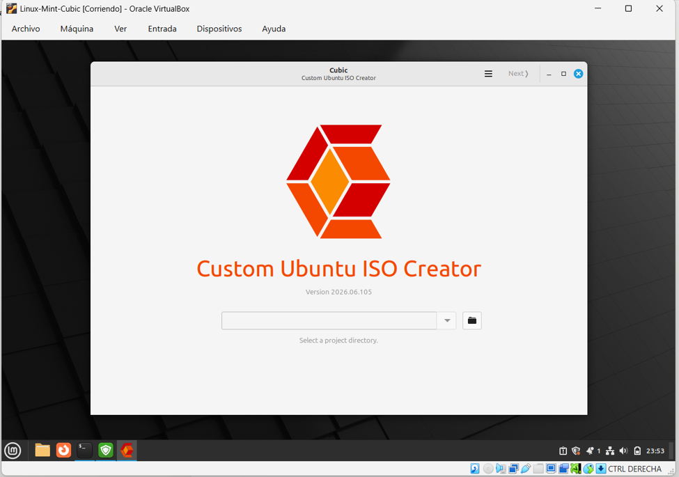
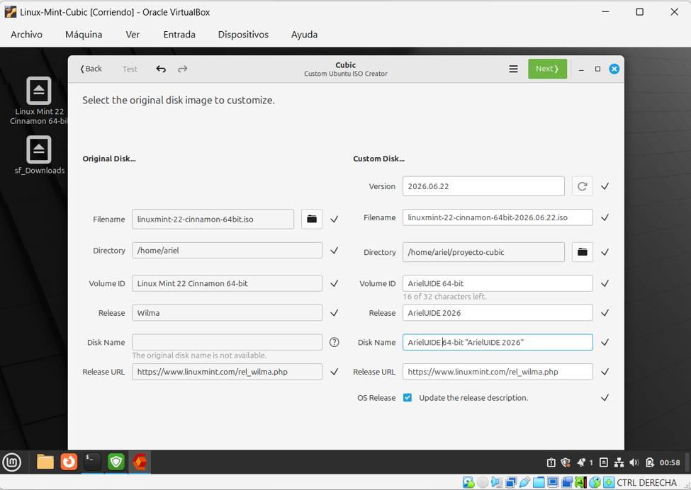
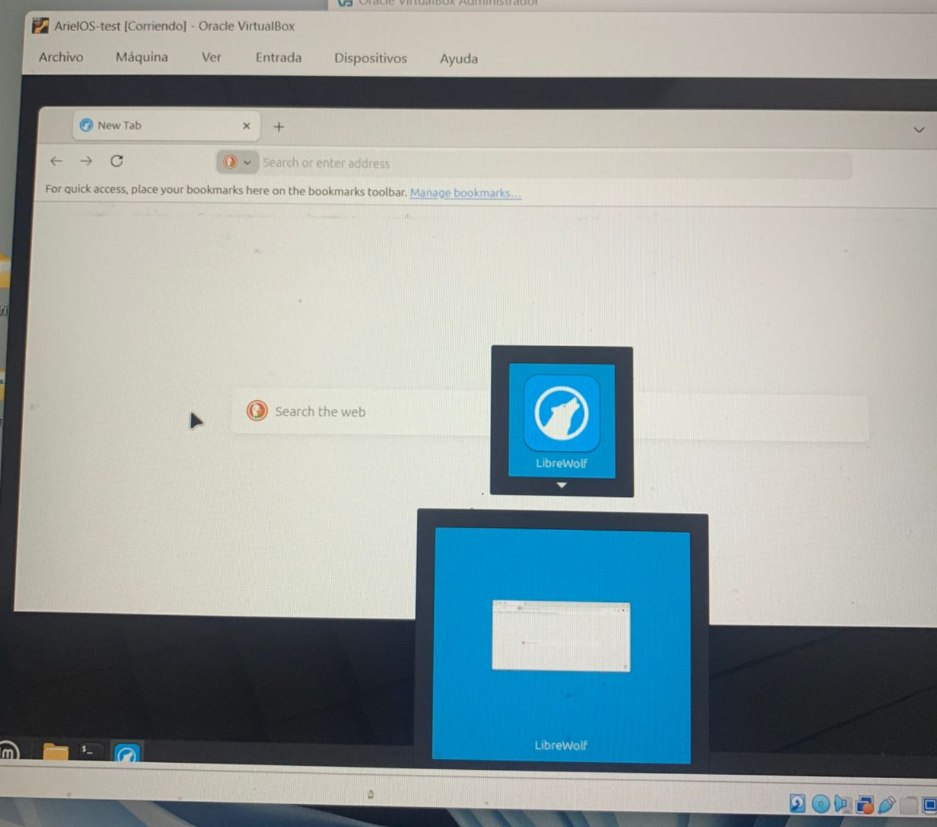
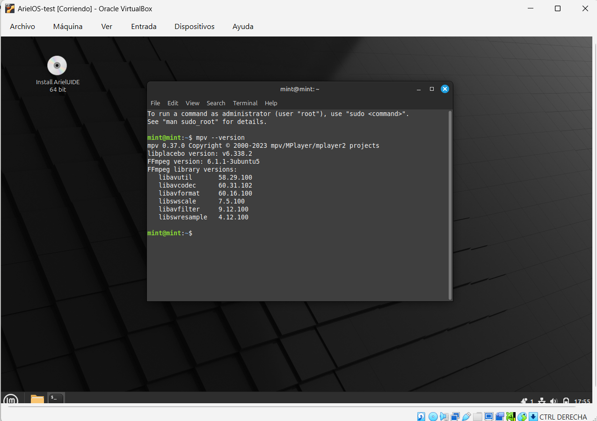
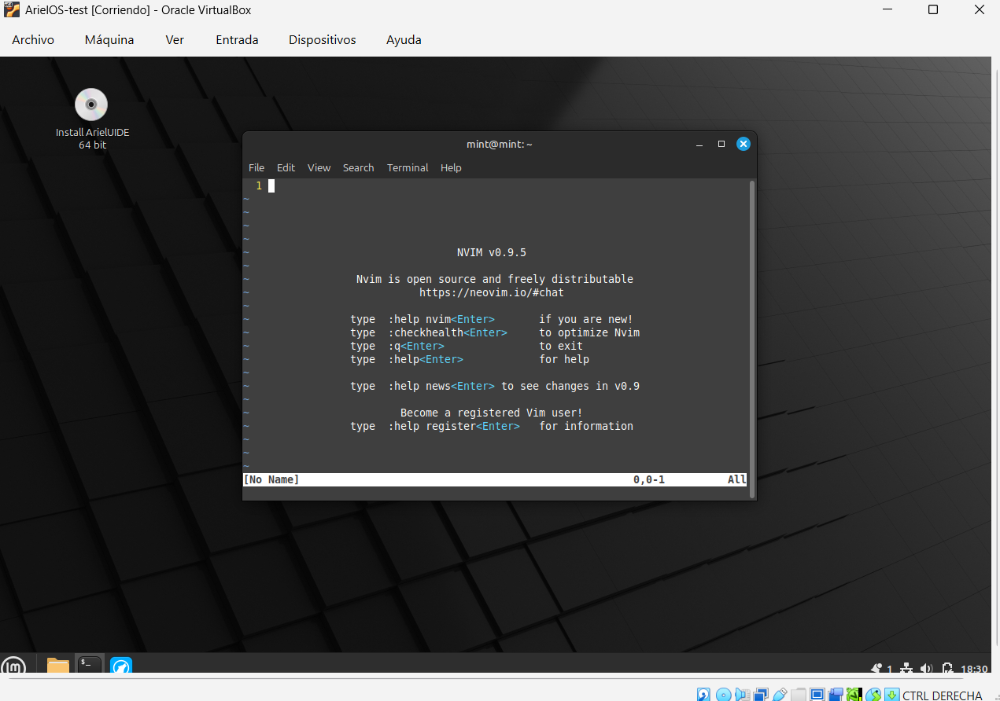
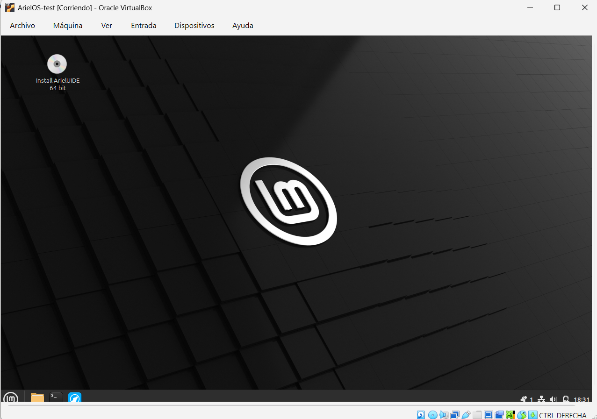
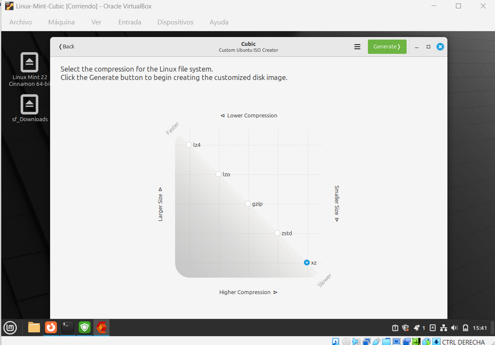
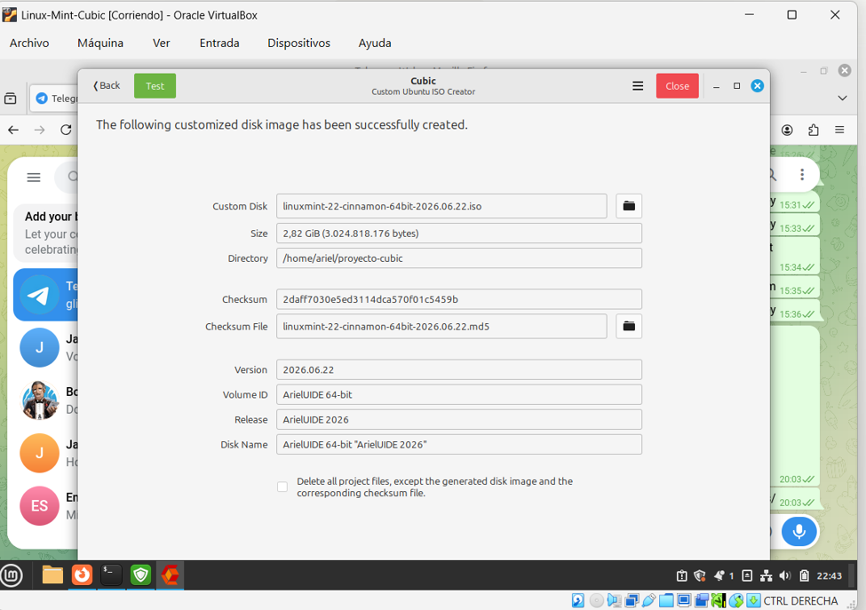

# Part 1 — Custom Distro with Cubic

**Author:** Ariel Buitron (@AreloXD2)

## Base ISO
Linux Mint 22.3 Cinnamon 64-bit (Wilma)

## Modifications

### 1. Firefox → LibreWolf
LibreWolf is a privacy-focused browser with no telemetry and enhanced security by default. Firefox was removed and replaced to give users a more private browsing experience out of the box.

### 2. MPV (media player)
MPV is a lightweight open-source media player that supports more codecs than the default player. It runs efficiently on low-resource systems and is highly configurable via terminal.

### 3. Neovim + /etc/skel configuration
Neovim is a modern terminal-based IDE. The configuration was placed in `/etc/skel/.config/nvim/` so every new user gets Neovim pre-configured with line numbers, mouse support, and syntax highlighting automatically.

### 4. Default theme via gschema
A custom gschema override file was created to set the dark theme as default for all users. This ensures the customization is persistent and applies system-wide, not just for one user.

## How to Reproduce

### Requirements
- VirtualBox installed on Windows
- Linux Mint 22.3 Cinnamon 64-bit ISO
- 50 GB free disk space, 4 GB RAM for the VM



### Step 1 — Set up the VM
1. Create a VM in VirtualBox (50 GB disk, 4096 MB RAM, 2 CPUs)
2. Mount the Linux Mint ISO and install it
3. Boot into the installed system



### Step 2 — Install Cubic
```bash
sudo apt update && sudo apt upgrade -y
sudo apt-add-repository ppa:cubic-wizard/release
sudo apt update && sudo apt install cubic -y
```


### Step 3 — Open Cubic
1. Create project folder: `mkdir ~/proyecto-cubic`
2. Open Cubic and select `~/proyecto-cubic` as project directory
3. Select `linuxmint-22.3-cinnamon-64bit.iso` as base ISO
4. Set custom name: `ArielUIDE 64-bit`, release: `ArielUIDE 2026`



### Step 4 — Apply modifications in chroot terminal

#### Update system
```bash
apt update && apt upgrade -y
```

#### Install LibreWolf (replaces Firefox)
```bash
apt remove --purge firefox -y
apt install extrepo -y
extrepo enable librewolf
apt update && apt install librewolf -y
```
**Already modified in the new distro**



#### Install MPV (media player)
```bash
apt install mpv -y
```
**Already modified in the new distro**



#### Install Neovim + configure /etc/skel
```bash
apt install neovim -y
mkdir -p /etc/skel/.config/nvim
cat > /etc/skel/.config/nvim/init.vim << 'EOF'
set number
set mouse=a
syntax on
EOF
```
**Already modified in the new distro**



#### Set default dark theme via gschema
```bash
mkdir -p /usr/share/glib-2.0/schemas/
cat > /usr/share/glib-2.0/schemas/99_custom-theme.gschema.override << 'EOF'
[org.cinnamon.desktop.interface]
gtk-theme='Mint-Y-Dark'
icon-theme='Mint-Y-Dark-Aqua'
[org.cinnamon.theme]
name='Mint-Y-Dark'
EOF
glib-compile-schemas /usr/share/glib-2.0/schemas/
```
**Already modified in the new distro**



### Step 5 — Generate ISO
1. Click Next (leave package removal unchecked)
2. Select **XZ compression**
3. Click **Generate** and wait (~2 hours)



## Generated ISO

| Field         | Value                                          |
|---------------|------------------------------------------------|
| Filename      | `linuxmint-22-cinnamon-64bit-2026.06.22.iso`   |
| Size          | 2.82 GiB (3,024,818,176 bytes)                 |
| MD5 Checksum  | `2daff7030e5ed3114dca570f01c5459b`             |


 **Download link**: [Google Drive](https://drive.google.com/file/d/1l8P4SYXwacbAljxfZOTB5pnkXdmPwxB1/view?usp=drive_link)                  

> To verify integrity after downloading:
> ```bash
> md5sum linuxmint-22-cinnamon-64bit-2026.06.22.iso
> # Expected: 2daff7030e5ed3114dca570f01c5459b
> ```



---