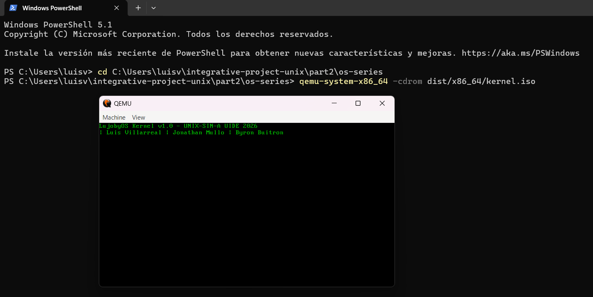

# Part 2 — 64-bit Kernel (LujobyOS)

## Description
64-bit kernel built from scratch following the tutorial by davidcallanan.
Implements Multiboot2, long mode, paging, and printing from C.

## Member
Luis Villarreal — SIN-A UIDE 2026

## Requirements
- Docker Desktop
- QEMU

## Build
```bash
docker build buildenv -t lujobyos-buildenv
docker run --rm -it -v "<absolute-path-to-part2/os-series>:/root/env" lujobyos-buildenv 
#In my case, I run it in this way: docker run --rm -it -v "C:\Users\luisv\integrative-project-unix\part2\os-series:/root/env" lujobyos-buildenv
make build-x86_64
exit
```

## Run
```bash
qemu-system-x86_64 -cdrom dist/x86_64/kernel.iso
```

## References
- Tutorial: https://www.youtube.com/watch?v=FkrpUaGThTQ
- Tutorial: https://www.youtube.com/watch?v=wz9CZBeXR6U
- Base repo: https://github.com/davidcallanan/os-series 

## Screenshot
The kernel boots successfully in QEMU, displaying the custom group message in 64-bit long mode.
