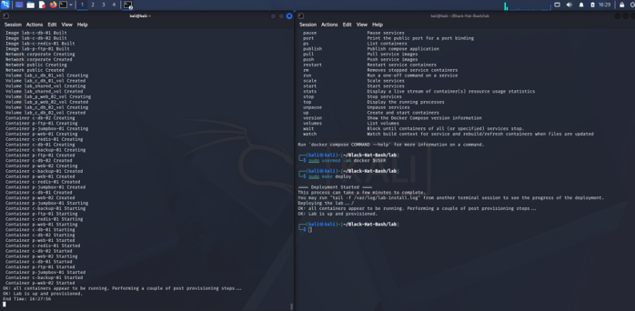
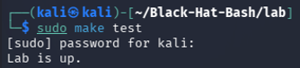
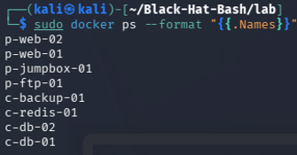
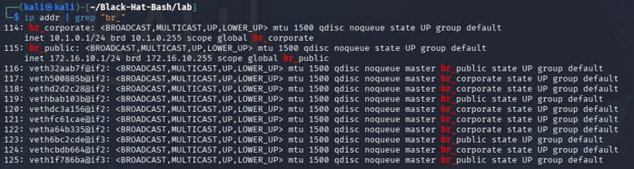
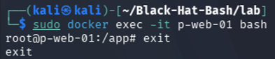
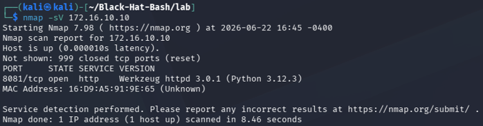
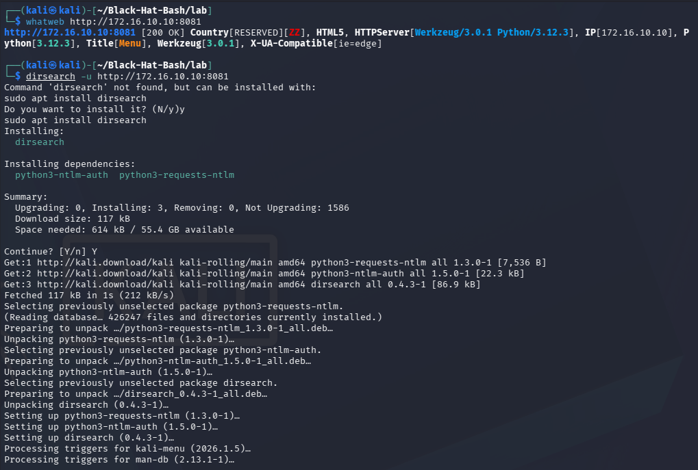
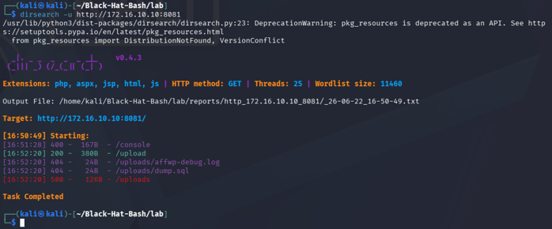
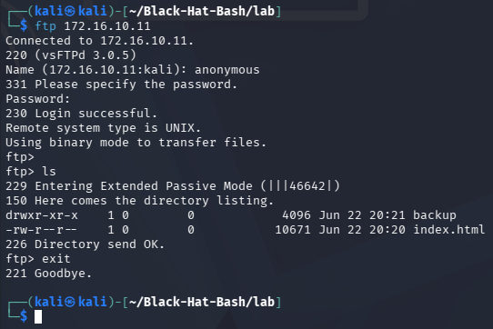

# Part 3 — Black Hat Bash Lab

##Member
Jonathan Mullo

### 3.A — Laboratory in operation

## Steps to reproduce
```bash
git clone https://github.com/dolevf/Black-Hat-Bash.git
cd Black-Hat-Bash/lab
sudo make deploy
sudo make test
```

## Evidence of deployment

**1. make deploy  Construction and startup of the 8 containers:**


**2. make test — Verification that the lab is active:**



**3. docker ps — All 8 containers running:**



**4. ip addr — br_public and br_corporate network interfaces:**


**5. docker exec — Access to machine p-web-01:**



## Laboratory architecture

With the command " sudo docker ps --format "{{.Names}}" " I verified that all 8 containers are running:

- p-web-01, p-web-02, p-ftp-01, p-jumpbox-01 → public network
- c-db-01, c-db-02, c-redis-01, c-backup-01 → corporate network

With `ip addr | grep "br_"` I confirmed the two network interfaces:
- `br_public` → 172.16.10.1/24
- `br_corporate` → 10.1.0.1/24

| Máquina      | IP Pública   | IP Corporativa | Hostname                               |
|--------------|--------------|----------------|----------------------------------------|
| Kali host    | 172.16.10.1  | 10.1.0.1       | —                                      |
| p-web-01     | 172.16.10.10 | —              | p-web-01.acme-infinity-servers.com     |
| p-ftp-01     | 172.16.10.11 | —              | p-ftp-01.acme-infinity-servers.com     |
| p-web-02     | 172.16.10.12 | 10.1.0.11      | p-web-02.acme-infinity-servers.com     |
| p-jumpbox-01 | 172.16.10.13 | 10.1.0.12      | p-jumpbox-01.acme-infinity-servers.com |
| c-backup-01  | —            | 10.1.0.13      | c-backup-01.acme-infinity-servers.com  |
| c-redis-01   | —            | 10.1.0.14      | c-redis-01.acme-infinity-servers.com   |
| c-db-01      | —            | 10.1.0.15      | c-db-01.acme-infinity-servers.com      |
| c-db-02      | —            | 10.1.0.16      | c-db-02.acme-infinity-servers.com      |

### 3.B — Hacking Technique

## Technique 1 — Port scanning with nmap (Basic)
**Command executed:**
```bash
nmap 172.16.10.10
```


It was discovered that p-web-01 has port 8081 open instead of the standard port 80. A real attacker scans all ports to avoid missing services running on unconventional ports.

## Technique 2 — Identification of web technology with WhatWeb (Intermediate)
**Command executed:**
```bash
whatweb http://172.16.10.10:8081
```



The server was identified as using Python 3.12.3 with Werkzeug 3.0.1, indicating a Flask application. Knowing the technological stack allows you to search for known vulnerabilities (CVEs) specific to those versions.

## Technique 3 — Anonymous FTP Login in p-ftp-01 (Intermediate)
**Command executed:**
```bash
ftp 172.16.10.11
# User: anonymous
# Password: (empty)
```




The FTP server allows anonymous access without a password. A publicly exposed "backup" folder and "index.html" file were found. In a real environment this is critical because backups usually contain passwords, configurations or sensitive system data.
